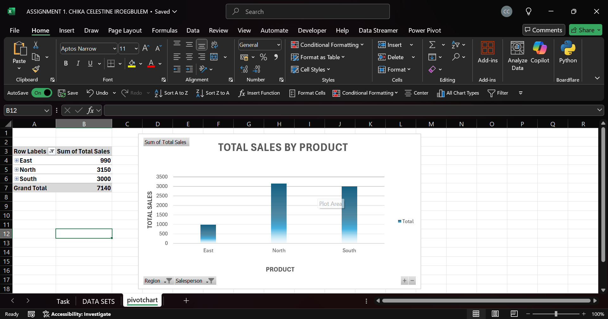

##Sales Data Pivot Analysis (Excel)

-A small dataset, a simple pivot, a clear answer: which region sells the most.

#What this project shows
-How to turn a tidy sales table into pivot tables and a column chart

#Files in this folder

01-Excel-Sales-Data-Pivot-Analysis/
├─ workbooks/

│└─ ASSIGNMENT 1. CHIKA CELESTINE IROEGBULEM.xlsx

├─ outputs/

│  └─ screenshots/

│     └─ total-sales-by-region.png   

└─ README.md

#Dataset (columns)
-Date

-Salesperson

-Region

-Product

-Units Sold

-Unit Price

-Total Sales → Units Sold * Unit Price
(If you have a Discount column, use Final Sales instead.)

#Step-by-step: how this was built (Excel)
1. Prepare data

-Make sure Units Sold, Unit Price, and Total Sales are numbers.

-If needed, add a Total Sales column: =Units Sold * Unit Price.

2. Create a PivotTable

-Select the data table → Insert → PivotTable.

-Rows: Region

-Values: Sum of Total Sales

- Filters/Slicers: Salesperson, Product.

3. Add a chart

-With the pivot selected → Insert → Column Chart.

-Title: TOTAL SALES BY REGION.

4. Make it easy to read

-Format currency, add data labels .

-Add slicers for quick exploration.

#Results (from this file)
| Region                 | Total Sales |
| ---------------------- | ----------: |
| East                   |         990 |
| North                  |       3,150 |
| South                  |       3,000 |
| **Grand Total: 7,140** |             |

#Takeaways

-North is the top-performing region.

-South is close behind.

-East lags and may need attention (pricing, volume, or product mix).

#How to view
-Open: workbooks/ASSIGNMENT 1. CHIKA CELESTINE IROEGBULEM.xlsx.

-Go to the pivotchart sheet.

-Use the Region / Salesperson slicers to explore.

-For a quick look without downloading, see 

#Tools & skills
-Excel — Pivot Tables, Pivot Charts, basic data cleaning, aggregation, and interpretation.
