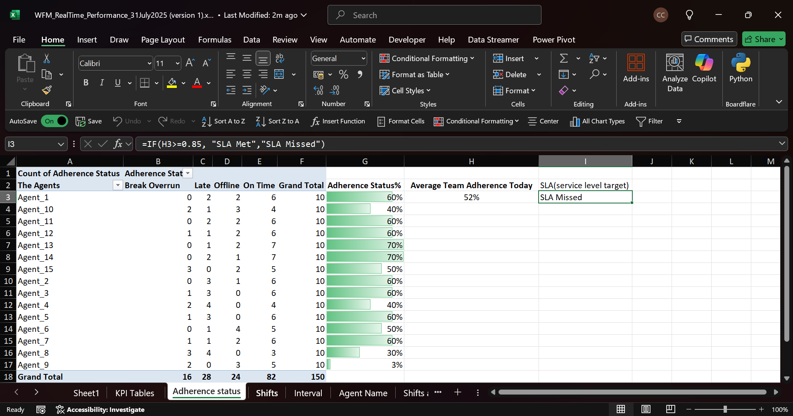
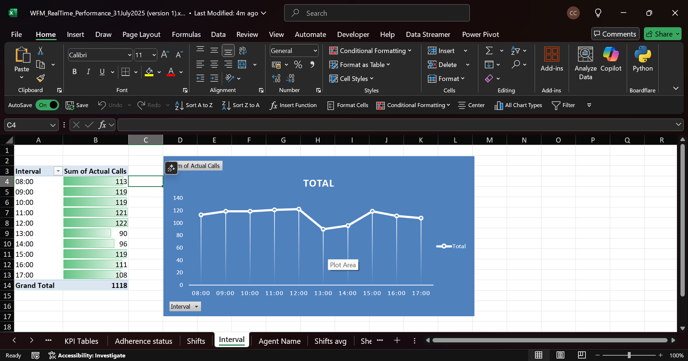

# 📊 Project 08 – Excel WFM Real-Time Performance Monitoring

This project simulates real-world Workforce Management (WFM) performance tracking using **Microsoft Excel**. It analyzes team adherence, agent productivity, and hourly call volumes to determine if **service level agreements (SLAs)** are being met.

---

### 🧠 Business Problem

WFM analysts must track in real-time:
- How many calls are planned vs. actually handled?
- Which agents are on time, late, or offline?
- What hours are the busiest?
- Are we meeting our SLA for adherence?

---

### 🛠️ Tools Used
- Microsoft Excel (Pivot Tables, Charts, Formulas)
- Conditional Formatting
- KPI Summary Tables

---

### 📁 Files in this Project
| File | Description |
|------|-------------|
| `WFM_RealTime_Performance_31July2025.xlsx` | Excel workbook with full data, dashboards, and charts |
| `My WFM_RealTime_Project_Report.docx` | Documented report of analysis methods, formulas, and findings |
| `Adherence status.png` | Visual showing agent adherence by status |
| `Sum actual by intervals.png` | Line chart of calls handled by hour |
| `Sum of actual calls by Agent.png` | Bar chart of agent-level call volume |

---

### ✅ Key Business Insights

| Metric | Value |
|--------|-------|
| **Planned Calls Today** | 1,335 |
| **Actual Calls Handled** | 1,118 |
| **Call Gap** | 217 |
| **Average Team Adherence** | 55% |
| **SLA Target** | 85% |
| **SLA Met?** | ❌ No |

---

### 📌 Sample Questions Answered

- Which agents need coaching due to low adherence?
- What hours had the highest and lowest traffic?
- Which agent handled the most calls?
- Are shifts equally productive?

---

### 🧾 Summary

This project showcases how Excel can be used for **real-time operational monitoring** — replicating the tasks of a WFM Analyst in a contact center. It emphasizes data-driven performance tracking and adherence analysis.

---

📄 [Download the Excel Dashboard](WFM_RealTime_Performance_31July2025.xlsx)  
📘 [Read the full report](My WFM_RealTime_Project_Report.docx)  

### 📸 Dashboard Visuals

  
  

